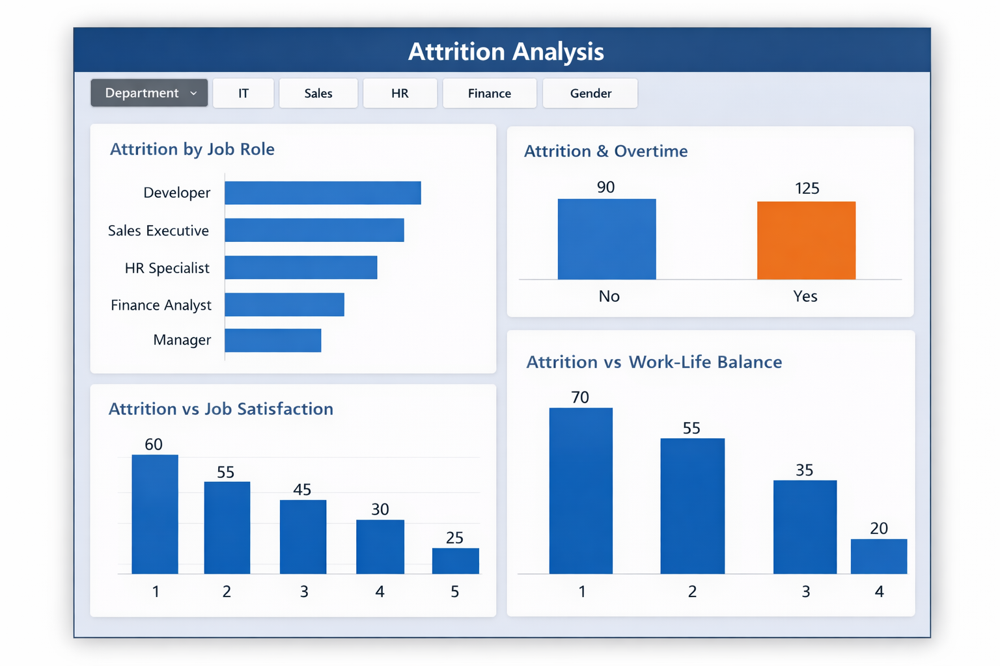
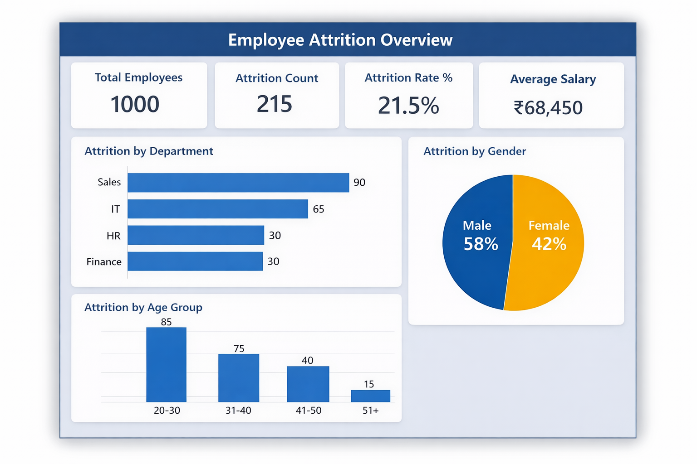

# Employee Attrition Analysis Dashboard (Power BI)

## Project Overview
This project analyzes employee attrition using Power BI to identify key factors affecting employee turnover.

## Objective
To understand attrition trends based on department, job role, overtime, and job satisfaction.

## Tools Used
- Power BI Desktop
- CSV Dataset
- DAX

## Key Metrics
- Total Employees
- Attrition Count
- Attrition Rate
- Average Salary

## Dataset
The dataset contains 1000 employee records with demographic and job-related details.

## Dashboard Screenshots

### Attrition Analysis Dashboard

### Employee Overview Dashboard

## Created By
Subashini
